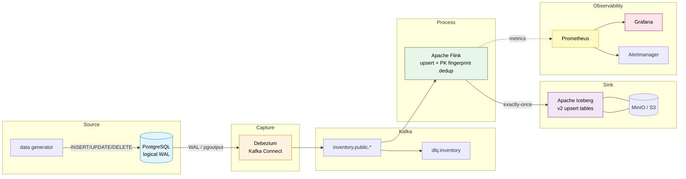
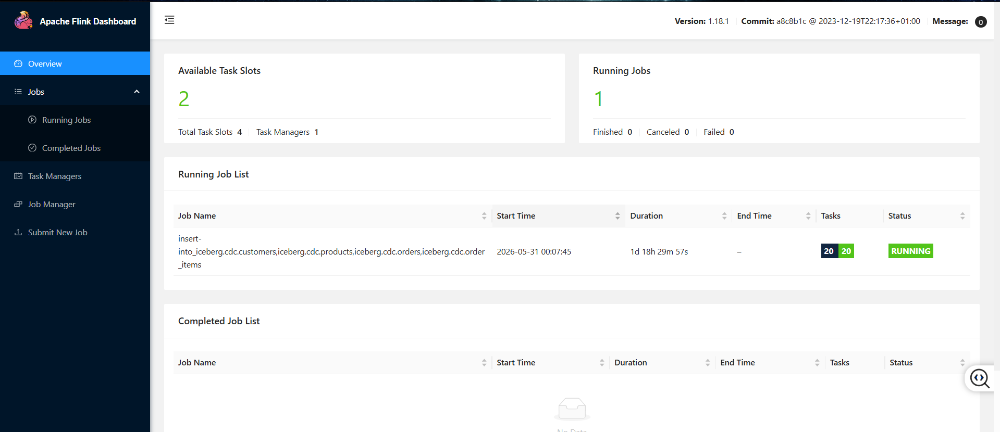
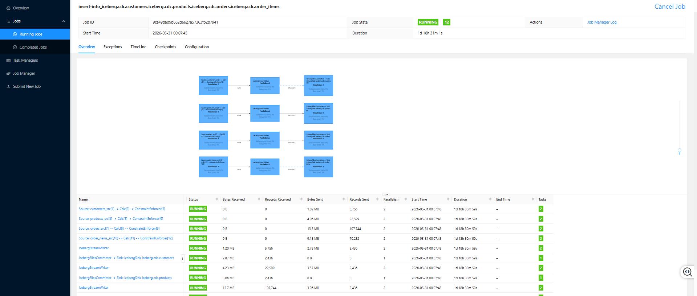
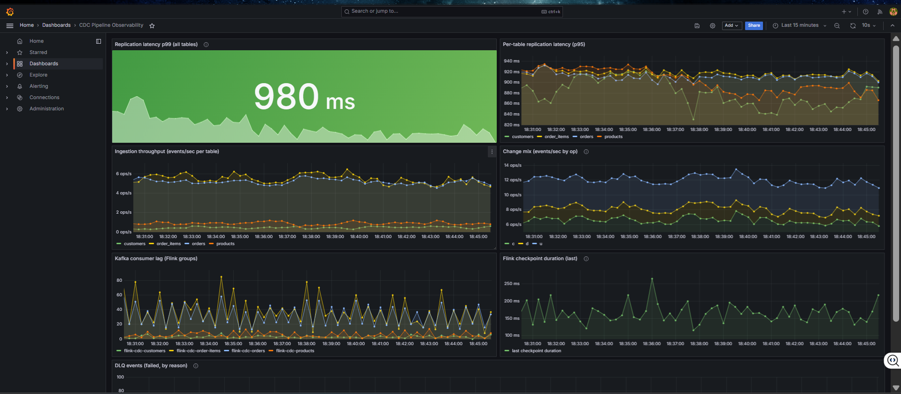
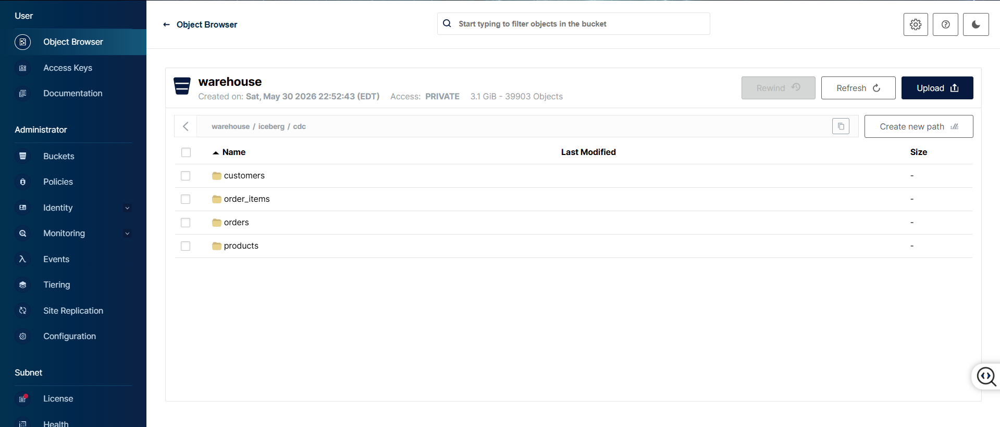

# CDC Pipeline with Operational Observability

[](https://www.python.org/)
[](https://flink.apache.org/)
[](https://kafka.apache.org/)
[](https://debezium.io/)
[](https://iceberg.apache.org/)
[](https://prometheus.io/)
[](https://grafana.com/)
[](https://www.docker.com/)
[](LICENSE)

A fully containerized Change Data Capture pipeline that streams every row-level INSERT, UPDATE, and DELETE from PostgreSQL into Apache Iceberg with exactly-once delivery, sub-3-second replication latency, primary-key deduplication, a dead-letter queue, and a full Prometheus + Grafana observability stack.

---

## Architecture



---

## Screenshots

**Flink dashboard — running CDC job**

The four CDC upserts run as a single Flink job, consuming the Debezium topics and
writing to Iceberg.



**Flink job detail — operators and checkpoints**

Per-operator throughput and the checkpoint history that drives exactly-once Iceberg
commits (one snapshot per completed checkpoint).



**Grafana — pipeline observability**

Per-table replication latency (p99 against the 3s SLA), ingestion throughput,
change mix by op, Kafka consumer lag, checkpoint duration, and DLQ events.



**MinIO — Iceberg warehouse**

Parquet data and equality-delete files committed to the `warehouse` bucket under
`iceberg/cdc/<table>/`, one set per checkpoint.



---

## Tech Stack

| Layer | Technology | Purpose |
|---|---|---|
| Source | PostgreSQL 16.4 | CDC source with logical WAL replication |
| Capture | Debezium 2.7 | Log-based CDC via Kafka Connect |
| Transport | Apache Kafka 3.7 | Durable, ordered event backbone |
| Processing | Apache Flink 1.18 | Stateful stream processing with exactly-once |
| Storage | Apache Iceberg 1.5 | Open lakehouse table format on object storage |
| Object Store | MinIO | S3-compatible local warehouse |
| Observability | Prometheus + Grafana | Metrics collection and dashboards |
| Alerting | Alertmanager | Alert routing and webhook delivery |
| Language | Python 3.11 | Exporters, DLQ router, data generator |

---

## Key Features

**Log-Based Change Data Capture**
Debezium reads PostgreSQL's Write-Ahead Log directly via the `pgoutput` plugin — zero load on the source database, no polling lag, and captures every INSERT, UPDATE, and DELETE as a structured Kafka event with before/after images.

**Exactly-Once Delivery**
Flink checkpoints every 10 seconds in `EXACTLY_ONCE` mode. The Iceberg sink commits one snapshot per completed checkpoint as an atomic JDBC catalog transaction, with the checkpoint ID stored in snapshot metadata — replayed checkpoints never double-commit.

**Primary-Key Fingerprinting and Deduplication**
Sources are decoded as Debezium changelog streams with `PRIMARY KEY ... NOT ENFORCED`, producing idempotent PK-keyed upserts. `pk_fingerprint` (MD5 of primary key) is the stable dedup key; `content_fingerprint` (MD5 of business columns) enables no-op-update detection.

**Schema Evolution Without Downtime**
Debezium emits new and changed columns automatically as the PostgreSQL schema changes. Iceberg v2 supports column add, drop, and rename without rewriting existing data files — schema changes propagate with no connector restart required.

**Dead Letter Queue and Alerting**
Malformed events are skipped by Flink (`ignore-parse-errors`) so the job never crashes, and simultaneously captured by the DLQ router which routes them to `dlq.inventory` with error-reason headers. Prometheus fires `DLQEventsDetected`, Alertmanager forwards to the webhook receiver — fully demonstrable with the included test script.

**Full Observability Stack**
7 auto-provisioned Grafana panels: replication latency p99 (with 3s SLA threshold), per-table latency p95, ingestion throughput, change mix by operation type, Kafka consumer lag, Flink checkpoint duration, and DLQ events by reason.

---

## Project Structure

```
cdc-pipeline/
├── docker-compose.yml          # All 15 services with health checks
├── .env.example                # Config template (copy to .env)
├── debezium/
│   ├── postgres-connector.json # Connector configuration
│   └── register-connector.ps1  # Registration script
├── flink/
│   ├── Dockerfile              # Custom image with Iceberg + Kafka JARs
│   ├── sql/                    # Flink SQL jobs (sources, upsert sink)
│   └── submit-iceberg-job.ps1  # Job submission script
├── generator/
│   └── generate_data.py        # Continuous INSERT/UPDATE/DELETE workload
├── monitoring/
│   ├── latency-exporter/       # Per-table replication latency + throughput
│   ├── dlq-router/             # DLQ routing + metrics
│   └── alert-webhook/          # Alert log receiver
├── config/
│   ├── prometheus/             # Scrape config + alert rules
│   ├── grafana/                # Provisioned datasource + dashboard
│   └── alertmanager/           # Alert routing config
└── scripts/
    └── test-dlq.ps1            # Inject malformed events to test DLQ loop
```

---

## Quick Start

### Prerequisites
- Docker Desktop (Windows / macOS / Linux)
- ~6 GB free RAM for the full stack
- Ports 5432, 8081, 8083, 9000, 9001, 9090, 9092, 9093, 3000 free

### 1. Clone and configure

```bash
git clone https://github.com/tejaswini-keerthi/cdc-pipeline.git
cd cdc-pipeline
cp .env.example .env
```

### 2. Build and start the stack

```powershell
docker compose up -d --build
docker compose ps   # wait until all services are healthy
```

### 3. Register the Debezium connector

```powershell
.\debezium\register-connector.ps1
# Expected: connector + task state RUNNING
```

### 4. Submit the Flink Iceberg job

```powershell
.\flink\submit-iceberg-job.ps1
# Job appears at http://localhost:8081
```

### 5. Start generating change events

```powershell
docker compose --profile generator up -d
```

---

## Observability Endpoints

| Service | URL | Credentials |
|---|---|---|
| Grafana dashboards | http://localhost:3000 | admin / see `.env` |
| Flink job UI | http://localhost:8081 | — |
| Prometheus | http://localhost:9090 | — |
| Alertmanager | http://localhost:9093 | — |
| MinIO console | http://localhost:9001 | see `.env` |

---

## Performance

| Metric | Value |
|---|---|
| Replication latency p99 (steady-state) | ~1s (SLA < 3s) |
| Replication latency p50 (steady-state) | ~0.5s |
| Checkpoint interval | 10s (exactly-once) |
| Tables tracked | 4 (customers, products, orders, order_items) |
| Grafana panels | 7 |
| Prometheus alert rules | 2 (HighReplicationLatency, DLQEventsDetected) |
| Services | 15 containerized |
| Image versions | All pinned (no `:latest`) |

---

## Engineering Decisions

**Debezium over Maxwell or AWS DMS** — Maxwell supports MySQL only. DMS is a managed black box that hides the mechanics of CDC. Debezium reads the PostgreSQL WAL directly via `pgoutput`, produces rich before/after envelopes, runs as a Kafka Connect plugin, and is what Netflix and Confluent run in production.

**Apache Flink over Spark Structured Streaming or Kafka Streams** — Flink models Debezium output natively as a changelog stream, with `+I/-U/+U/-D` operators mapping directly to insert, update-before, update-after, and delete. Kafka Streams has no native Iceberg connector. Spark Streaming's micro-batch model introduces unnecessary latency for a sub-3-second SLA.

**Apache Iceberg over Delta Lake or Hudi** — Delta Lake's Flink connector is community-maintained and not production-grade. Hudi is a strong alternative for high-frequency upserts but has narrower multi-engine support. Iceberg's Flink connector is maintained by the Apache project itself and supports hidden partitioning, preventing partition evolution mistakes at write time.

**DLQ router over Kafka Connect's built-in DLQ** — Kafka Connect's `deadletterqueue.*` feature is sink-only and silently ignored on source connectors. The DLQ router is a dedicated service that captures parse failures, routes them to `dlq.inventory` with error-reason headers, and exposes a Prometheus metric — making failures observable rather than invisible.

---

## Teardown

```powershell
docker compose --profile generator down   # stop, keep data volumes
docker compose down -v                    # stop + wipe volumes (full reset)
```

---

## License

MIT — see [LICENSE](LICENSE).

## Author

**Tejaswini Keerthi** — [GitHub](https://github.com/tejaswini-keerthi) · [LinkedIn](https://linkedin.com/in/tejaswini-keerthi)
