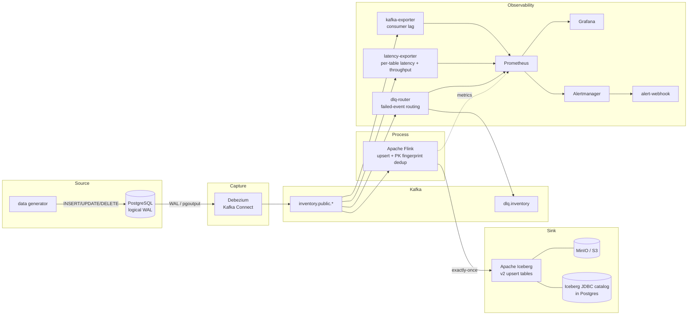

# CDC Pipeline with Operational Observability

A fully containerized Change Data Capture pipeline that streams row-level changes
from PostgreSQL into Apache Iceberg with **exactly-once** delivery, sub-3-second
replication latency, primary-key deduplication, a dead-letter queue, and a full
Prometheus + Grafana observability stack.

```
PostgreSQL (WAL) ──▶ Debezium ──▶ Kafka ──▶ Apache Flink ──▶ Apache Iceberg (MinIO)
                                    │              │
                                    │              └─▶ exactly-once upsert + dedup
                                    ├─▶ dlq-router ─▶ dlq.inventory (failed events)
                                    └─▶ exporters ─▶ Prometheus ─▶ Grafana / Alertmanager
```

## Architecture



## Services

| Service | Image | Port(s) | Role |
|---|---|---|---|
| postgres | `postgres:16.4` | 5432 | CDC source (logical WAL) + Iceberg JDBC catalog DB |
| zookeeper | `confluentinc/cp-zookeeper:7.6.1` | 2181 | Kafka coordination |
| kafka | `confluentinc/cp-kafka:7.6.1` | 9092 | Event backbone |
| connect | `debezium/connect:2.7.3.Final` | 8083 | Debezium Postgres connector |
| jobmanager | `cdc-pipeline/flink:0.3.0` | 8081 | Flink coordinator + web UI |
| taskmanager | `cdc-pipeline/flink:0.3.0` | — | Flink worker |
| minio | `minio/minio:RELEASE.2024-08-17T01-24-54Z` | 9000 / 9001 | Iceberg warehouse (S3) |
| minio-setup | `minio/mc:RELEASE.2024-08-17T11-33-50Z` | — | One-shot: creates `warehouse` bucket |
| kafka-exporter | `danielqsj/kafka-exporter:v1.7.0` | 9308 | Consumer-lag metrics |
| latency-exporter | `cdc-pipeline/latency-exporter:0.1.0` | 8000 | Per-table latency + throughput |
| dlq-router | `cdc-pipeline/dlq-router:0.1.0` | 8001 | DLQ routing + metrics |
| prometheus | `prom/prometheus:v2.53.1` | 9090 | Metrics store + alert rules |
| grafana | `grafana/grafana:11.1.4` | 3000 | Dashboards |
| alertmanager | `prom/alertmanager:v0.27.0` | 9093 | Alert routing |
| alert-webhook | `cdc-pipeline/alert-webhook:0.1.0` | — | Logs alerts (notifier stand-in) |
| generator | `cdc-pipeline/generator:0.1.0` | — | Workload generator (opt-in profile) |

All image versions are pinned (no `:latest`).

## Prerequisites

- Docker Desktop (Windows/macOS/Linux)
- ~6 GB free RAM for the full stack
- Ports above free on the host

## Quick start

```powershell
# 1. Create your env file (then edit secrets if desired)
Copy-Item .env.example .env

# 2. Build images and start the stack
docker compose up -d --build

# 3. Wait until everything is healthy
docker compose ps

# 4. Register the Debezium connector (Postgres -> Kafka)
.\debezium\register-connector.ps1

# 5. Submit the Flink job (Kafka -> Iceberg, exactly-once)
.\flink\submit-iceberg-job.ps1

# 6. Start generating change events
docker compose --profile generator up -d
```

On macOS/Linux use the `.sh` equivalents in `debezium/` and `flink/`.

## Where to look

| What | URL | Notes |
|---|---|---|
| Flink jobs | http://localhost:8081 | running job, checkpoints |
| Grafana | http://localhost:3000 | admin / `GRAFANA_ADMIN_PASSWORD` |
| Prometheus | http://localhost:9090 | targets, alerts |
| Alertmanager | http://localhost:9093 | firing alerts |
| MinIO console | http://localhost:9001 | Iceberg data files in `warehouse` |

## Verifying the pipeline

```powershell
# Topics created by Debezium
docker exec cdc-kafka kafka-topics --bootstrap-server localhost:9092 --list

# A live change event (note the +I/+U/-D changelog ops)
docker logs -f cdc-flink-taskmanager

# Iceberg data files appearing in MinIO
#   open http://localhost:9001  ->  bucket "warehouse" -> iceberg/cdc/<table>
```

## How the requirements are met

- **Exactly-once:** Flink checkpoints every 10s in `EXACTLY_ONCE` mode; the Iceberg
  sink commits exactly one snapshot per completed checkpoint as an atomic JDBC
  catalog transaction. The committed checkpoint id is stored in snapshot metadata,
  so a replayed checkpoint never double-commits.
- **Deduplication (primary-key fingerprinting):** sources are decoded as Debezium
  changelogs with `PRIMARY KEY ... NOT ENFORCED`, producing idempotent PK-keyed
  upserts — replayed/at-least-once events converge onto one row. `pk_fingerprint`
  (`MD5(pk)`) is the stable dedup key; `content_fingerprint` enables no-op-update
  detection.
- **Sub-3s latency:** measured per table by the latency-exporter from Debezium's
  `source.ts_ms`; surfaced on Grafana with a 3s SLA threshold and a Prometheus
  alert (`HighReplicationLatency`).
- **Schema evolution:** Debezium emits new/changed columns automatically as the
  Postgres schema changes (no connector downtime). The exporters and dlq-router
  are schema-agnostic. For the Flink→Iceberg path, adding a column means an
  `ALTER TABLE` on the Iceberg target plus the matching source column — Iceberg v2
  supports column add/drop/rename without rewriting data.
- **DLQ + alerting:** see below.

## Observability

7 Grafana panels (auto-provisioned): replication latency p99 (SLA gauge),
per-table latency p95, ingestion throughput, change mix by op, Kafka consumer lag,
Flink checkpoint duration, and DLQ events by reason.

Metric sources:
- **kafka-exporter** → `kafka_consumergroup_lag` (consumer lag)
- **latency-exporter** → `cdc_replication_latency_seconds`, `cdc_events_total`
- **dlq-router** → `cdc_dlq_events_total`
- **Flink Prometheus reporter** (`:9249`) → checkpoints, records/sec

## Dead Letter Queue + alerting

Malformed events are **skipped by Flink** (`debezium-json.ignore-parse-errors`, so
the job never crashes) and **captured by the dlq-router**, which routes them to the
`dlq.inventory` topic with error-reason headers and increments
`cdc_dlq_events_total`. Prometheus fires `DLQEventsDetected`, Alertmanager forwards
to the webhook receiver.

Demonstrate the whole loop:

```powershell
.\scripts\test-dlq.ps1
docker logs --tail 20 cdc-dlq-router      # routed events
docker logs --tail 20 cdc-alert-webhook   # the alert firing
```

> Kafka Connect's built-in `deadletterqueue.*` is sink-only and is intentionally
> not relied upon for this source connector; the dlq-router is the pipeline DLQ.

## Project structure

```
docker-compose.yml          all services
.env / .env.example         secrets (gitignored) / template
sql/init/                   Postgres schema, seed, catalog DB (auto-run on init)
debezium/                   connector config + registration scripts
flink/                      custom image, SQL jobs, submit scripts
generator/                  workload generator
monitoring/
  latency-exporter/         per-table latency + throughput
  dlq-router/               DLQ routing + metrics
  alert-webhook/            alert logger
config/
  prometheus/               scrape config + alert rules
  grafana/                  provisioned datasource + dashboard
  alertmanager/             alert routing
scripts/                    test-dlq demo
```

## Teardown

```powershell
docker compose --profile generator down     # stop (keep data)
docker compose down -v                       # stop + wipe volumes (full reset)
```

> Postgres `sql/init/` scripts only run on a fresh data volume. If you started the
> stack before adding schema, run `docker compose down -v` then `up` again.
